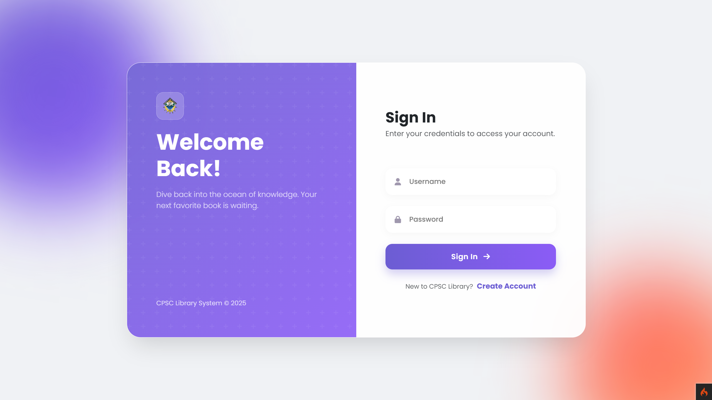

# 📚 Library Management System

A web-based **Library Management System** designed to streamline library operations by allowing administrators to manage books, members, borrowing transactions, and fines, while members can browse available books, borrow items, and track their borrowing history.

## 🚀 Project Overview

The application is built with **PHP**, **CodeIgniter 4**, and **MySQL**, following the MVC architecture. It provides separate experiences for **Administrators** and **Members**, with each role having access to features relevant to their responsibilities.

## 👥 User Roles

### 1. Administrator

Administrators can:

* View an overview through the dashboard.
* Add, edit, and manage books.
* Manage member accounts.
* Process book borrowings and returns.
* Manage fines and payments.
* View rental and revenue reports.
* Print reports.

### 2. Member

Members can:

* View available books.
* Register and manage their account profile.
* View their borrowing history.
* Track active borrowings and due dates.

## 📖 Key Features

| **Feature**               | **Description**                                                         |
| ------------------------- | ----------------------------------------------------------------------- |
| **Book Management**       | Add, edit, delete, and manage book information, images, and availability. |
| **Member Management**     | Manage registered member accounts and personal information.             |
| **Borrowing System**      | Create and manage book borrowing transactions with 7-day due dates.     |
| **Return Processing**     | Process book returns and automatically calculate overdue fines.         |
| **Fine Management**       | Record and manage late return fines at a configurable daily rate.       |
| **Dashboard**             | Provides an overview of books, members, borrowings, and overdue items.  |
| **Reports**               | View borrowed books, available inventory, and overdue items with print. |
| **Authentication**        | Secure login and registration with role-based access.                   |

## 🏗️ System Architecture

The project follows the **Model-View-Controller (MVC)** architecture provided by CodeIgniter 4.

* **Controllers** – Handle application logic and user requests.
* **Models** – Manage database operations and business data.
* **Views** – Provide the user interface for administrators and members.
* **Routes** – Define how users access different system features.

## 🗄️ Database

The system uses **MySQL/MariaDB** to manage its core data, including:

* Users
* Books
* Members
* Transactions
* Fines

## 🔐 Demo Credentials

Use the following account to access the administrator features:

| **Account**  | **Credentials** |
| ------------ | --------------- |
| **Username** | `admin`         |
| **Password** | Seeded in `library_db.sql` |

> **Note:** These credentials are intended for local/demo use only. The default admin account is pre-seeded in the database file.

## 🛠️ Technologies Used

* **PHP**
* **CodeIgniter 4**
* **MySQL / MariaDB**
* **HTML**
* **CSS**
* **JavaScript**
* **Composer**

## 💻 How to Install & Run

### 1. Install the Requirements

Before running the project, install:

* **PHP 8.1 or higher**
* **Composer**
* **MySQL / MariaDB**
* **XAMPP** or another local PHP development environment

### 2. Download the Project

Clone the repository:

```bash
git clone https://github.com/your-repo/library-management-system.git
```

Then enter the project directory:

```bash
cd library-management-system
```

You can also download the repository as a **ZIP** and extract it to your local development folder.

### 3. Install CodeIgniter Dependencies

Inside the project folder, run:

```bash
composer install
```

This installs the PHP dependencies required by the CodeIgniter 4 application.

### 4. Configure the Environment

Copy the example environment file:

```bash
copy env .env
```

Then open `.env` and configure your database connection.

Example:

```env
database.default.hostname = localhost
database.default.database = library_db
database.default.username = root
database.default.password =
database.default.DBDriver = MySQLi
database.default.port = 3306
```

Adjust the database name, username, and password according to your local MySQL configuration.

### 5. Create the Database

Open **phpMyAdmin** or MySQL and create a database for the project.

For example:

```text
library_db
```

Import the SQL database file included in the project:

```text
library_db.sql
```

This will create the required tables and sample data.

### 6. Start the CodeIgniter Development Server

From the project directory, run:

```bash
php spark serve
```

The application will normally be available at:

```text
http://localhost:8080
```

Open the address in your browser.

### 7. Login

Use the demo administrator account:

```text
Username: admin
Password: [see library_db.sql]
```

## 🔄 Borrowing Workflow

**Browse Books → Check Availability → Select Member → Borrow Book → Return Book → Pay Fines (if overdue)**

## 🎯 Project Purpose

This project was developed to demonstrate practical skills in **web development, database management, MVC architecture, CRUD operations, authentication, library management, transaction processing, and reporting**.

## 📸 System Preview

### Login

